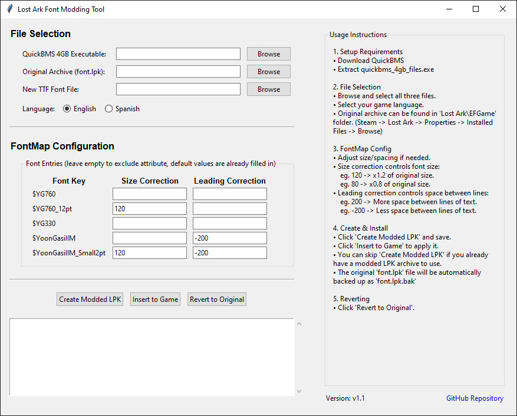
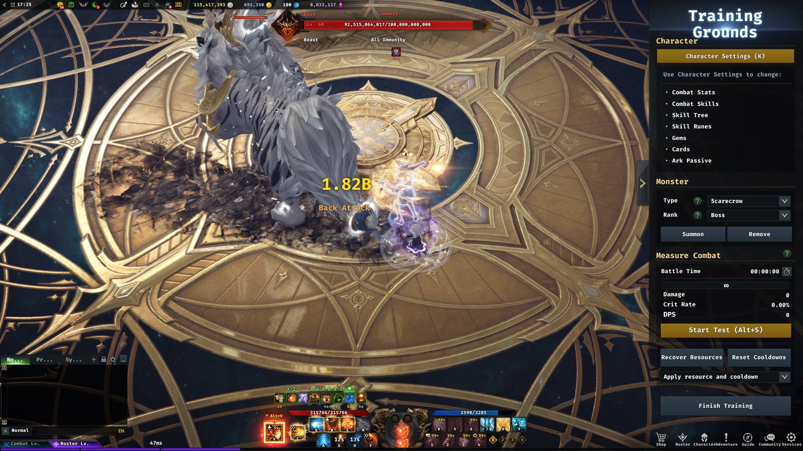

# Lost Ark Font Modding Tool

A simple GUI tool for modding fonts in Lost Ark by patching the `font.lpk` archive. Easily swap in custom TTF fonts and adjust font size and line spacing for English and Spanish game versions.

## Features

- **Easy-to-use GUI** for selecting files and configuring font settings
- **Supports English and Spanish** Lost Ark versions (Steam)
- **FontMap.xml generator** with customizable size and leading corrections
- **Automatic backup and restore** of original font.lpk
- **QuickBMS integration** for safe archive patching

## Screenshots

### Main GUI

### In-game Showcase (FiraCode-Bold Font)

## Requirements

- **Python 3.8+**  
  [Download Python](https://www.python.org/downloads/)

- **QuickBMS Executable**  
  [Download QuickBMS](https://github.com/LittleBigBug/QuickBMS/releases/download/0.12.0/quickbms_win.zip)

## Setup

1. **Install Python**  
   Download and install Python from the link above. Make sure to add Python to your PATH.

2. **Download QuickBMS**  
   Extract `quickbms_4gb_files.exe` from the QuickBMS zip file.

3. **Download the latest release**  
   [Download LOA Font Tool v1.1](https://github.com/TanByv/LOA-Font-Tool/releases/download/Release/LOA-Font-Tool.exe)

## Usage

1. **Run the tool**
   - Run `LOA-Font-Tool.exe`

2. **Select required files in the GUI**
   - QuickBMS executable (`quickbms_4gb_files.exe`)
   - Original archive (`font.lpk`) from your Lost Ark installation (`Steam/steamapps/common/Lost Ark/EFGame`)
   - Your custom TTF font file

3. **Configure FontMap settings**
   - Adjust size correction and leading correction as needed for each font entry.

4. **Choose your game language**
   - English or Spanish

5. **Create Modded LPK**
   - Click "Create Modded LPK" and save the output file.

6. **Insert to Game**
   - Click "Insert to Game" to automatically backup and replace the game's font.lpk.

7. **Revert to Original**
   - Click "Revert to Original" to restore the backup.

## Notes

- The original `font.lpk` will be backed up as `font.lpk.bak` before any changes.
- For other languages, you may need to adjust target indices & encryption keys in the code.
- Contributions are welcome for adding support for Korean and Russian versions of the game. (Need testers)

## Troubleshooting

- **QuickBMS not found:**  
  Make sure you select the correct `quickbms_4gb_files.exe` file.

- **Game directory not detected:**  
  Manually browse to your Lost Ark `EFGame` folder when prompted.

- **Permission errors:**  
  Run the tool as administrator.

## Credits

- LOA Font Tool by [Tan](https://github.com/tanbyv) (Discord: @tanbb)
- Original QuickBMS Repacking Script by [spiritovod & Brouznouf](https://zenhax.com/viewtopic.php@t=2969.html)
- [QuickBMS](https://aluigi.altervista.org/quickbms.htm) by Luigi Auriemma
